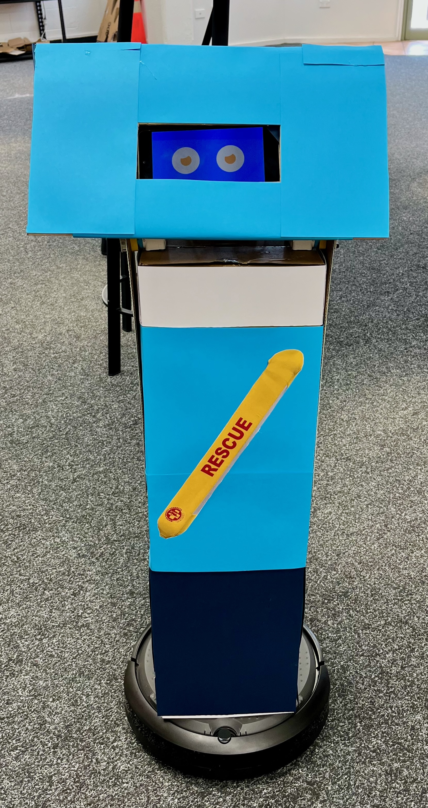

# Roaming Roombas: DIY Social Robot Platform

Roaming Roombas is a versatile, low-cost platform for building expressive and customizable social robots using the Create3 Roomba as a movement hub. Designed for Human-Robot Interaction (HRI) research and education, it enables rapid prototyping through 3D printing or cardboard crafting, and supports real-time facial expressions and behavior control via Python or ROS2.

## 🚀 Features

- **Modular Design**: Easily adapt robot size and appearance using 3D printed or cardboard components.
- **Expressive Faces**: Display reactive facial expressions on a touchscreen or mobile device.
- **Flexible Behaviors**: Define robot actions using a storyboard-driven software architecture.
- **Open Source**: Hardware designs and software are customizable and extensible.
- **Low-Cost**: Build robots for under \$600 USD using accessible materials and components.

## 🧱 Architecture

### Hardware
- **Movement Hub**: iRobot Create3
- **Controller**: Raspberry Pi 4B
- **Face Display**: 7" touchscreen or mobile device
- **Sensors**: IR proximity and bump sensors
- **Power**: Powered via Create3’s onboard battery
  
A full price list with links to necessary components is available in the Hardware folder above. 

### Software
- **Languages**: Python or ROS2
- **Components**:
  - `MotionNode`: Manages movement phases and sensor input
  - `PhaseController`: Links behaviors to expressions
  - `BlinkManager`: Adds lifelike blinking
  - `Storyboard`: Maps user-defined scenarios to robot actions

## 🤖 Example Robots

### Bubbles

Bubbles is a cute, child-friendly robot with smooth movements and rounded features. Ideal for school and playful environments.

### Spike

Spike is angular and intimidating, designed for security and patrol tasks, featuring jerky movements and grumpy expressions.

### BeachBot

BeachBot is crafted from cardboard and Lego, designed to assist beachgoers with safety info and navigation.

## 🙏 Acknowledgements

We gratefully acknowledge the contributions of students and participants involved in the co-design workshops that shaped the development of the Roaming Roombas platform. Their creativity, diverse use case ideas, and design insights were instrumental in validating the feasibility and adaptability of the system.

**With special thanks to** the developers of **Bubbles**, **Spike**, and **BeachBot** for their innovative prototypes and commitment to accessible social robots. This project would not have been possible without their enthusiasm and imagination.
