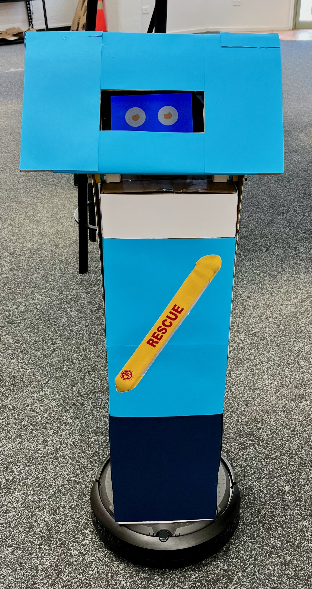

# Roaming Roombas: DIY Social Robot Platform

Roaming Roombas is a versatile, low-cost platform for building expressive and customizable social robots using the Create3 Roomba as a movement hub. Designed for Human-Robot Interaction (HRI) research and education, it enables rapid prototyping through 3D printing or cardboard crafting, and supports real-time facial expressions and behavior control via Python or ROS2.

## 🚀 Features

- **Modular Design**: Easily adapt robot size and appearance using 3D printed or cardboard components.
- **Expressive Faces**: Display reactive facial expressions on a touchscreen or mobile device.
- **Flexible Behaviors**: Define robot actions using a storyboard-driven software architecture.
- **Open Source**: Hardware designs and software are customizable and extensible.
- **Low-Cost**: Build robots for under \$600 USD using accessible materials and components.

## 🧱 Architecture

### Hardware

- **Movement Hub**: iRobot Create3
- **Controller**: Raspberry Pi 4B
- **Face Display**: 7" touchscreen or mobile device
- **Sensors**: IR proximity and bump sensors
- **Power**: Powered via Create3’s onboard battery

A full price list with links to necessary components is available in the Hardware folder above.

### Software

- **Languages**: Python or ROS2
- **Components**:
  - `MotionNode`: Manages movement phases and sensor input
  - `PhaseController`: Links behaviors to expressions
  - `BlinkManager`: Adds lifelike blinking
  - `Storyboard`: Maps user-defined scenarios to robot actions

## Setup of Create3 Platform with Rasberry Pi

### Prerequisites

1. **Install Ubuntu on your Raspberry Pi**  
   Follow the official installation instructions [here](https://ubuntu.com/download/raspberry-pi).

2. **Install ROS 2**  
   Use the binary installation guide for Ubuntu found [here](https://docs.ros.org/en/kilted/Installation/Alternatives/Ubuntu-Development-Setup.html).

### Connecting Raspberry Pi and Create 3 via USB-C

Follow [Jim Bennett’s guide](https://jimbobbennett.dev/blogs/irobot-create3-connect-a-pi/) for setting up USB-C communication between your Raspberry Pi and the Create 3.

### ROS 2 Communication Setup

Once the USB connection is successful, you can launch ROS 2 nodes on the Pi that communicate with the Create 3.
You may need to ensure the ROS Domain ID matches.

Check or Create `ROS_DOMAIN_ID` in `.bashrc`

Open your .bashrc file on the Raspberry Pi:

```js
nano ~/.bashrc
```

Add or update the following line, matching the Domain ID of your Create 3 robot (e.g., 0 is default):

```js
export ROS_DOMAIN_ID=0  (or whatever value your Create3 is set to)
```

Save and apply the changes:

```js
source ~/.bashrc
```

### Check Create 3 Configuration Interface

You can configure the Create 3 robot's domain ID and ROS namespace via its web interface:

1. Connect to the robot’s configuration page (see IP address assigned to the robot).
2. Update ROS 2 Domain ID to match your Pi’s .bashrc.
3. Save and Restart Application for changes to take effect.

### Verifying ROS 2 Topics

After updating your domain ID or RMW implementation, you must restart ROS 2 on both devices (or just reboot them) for changes to take effect.

- Use `ros2 topic list` after both are set up to confirm connection.

## Setting up ROS2

### ROS2 Workspace

To set up the ROS2 workspace, you may follow the official documentation here: [Creating a Workspace - ROS2 Documentation](https://docs.ros.org/en/kilted/Tutorials/Beginner-Client-Libraries/Creating-A-Workspace/Creating-A-Workspace.html).

However, it is recommended to follow his video: [“ROS2 Tutorial – ROS2 Humble Crash Course”](https://www.youtube.com/watch?v=Gg25GfA456o) (by Robotics Back‑End) starting at 21:29 (0:21:29) up to 29:18 (0:29:18) as it covers setting up a ROS 2 workspace nicely.

<!-- Need to figure out how to explain the create3 topics and how they work with the ros2 directory structure which looks something like this -->

```
src/
├── my_robot_controller/
│   ├── my_robot_controller/
│   │   ├── __init__.py
│   │   └── robot_node.py
│   ├── resource/
│   ├── test/
│   ├── package.xml
│   ├── setup.cfg
│   └── setup.py
```

## 🤖 Example Robots

### Bubbles


Bubbles is a cute, child-friendly robot with smooth movements and rounded features. Ideal for school and playful environments.

### Spike


Spike is angular and intimidating, designed for security and patrol tasks, featuring jerky movements and grumpy expressions.

### BeachBot


BeachBot is crafted from cardboard and Lego, designed to assist beachgoers with safety info and navigation.

## 🙏 Acknowledgements

We gratefully acknowledge the contributions of students and participants involved in the co-design workshops that shaped the development of the Roaming Roombas platform. Their creativity, diverse use case ideas, and design insights were instrumental in validating the feasibility and adaptability of the system.

**With special thanks to** the developers of **Bubbles**, **Spike**, and **BeachBot** for their innovative prototypes and commitment to accessible social robots. This project would not have been possible without their enthusiasm and imagination.
